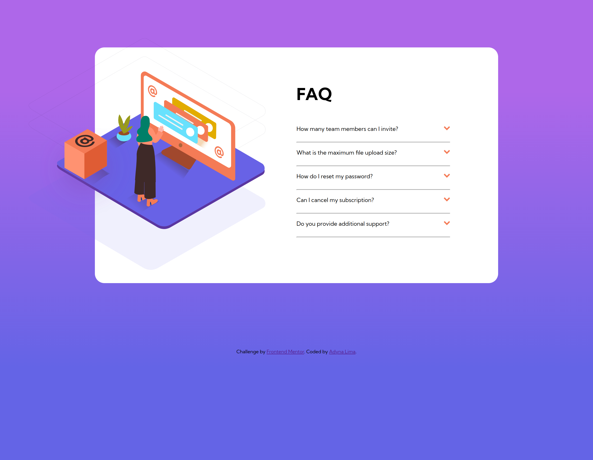
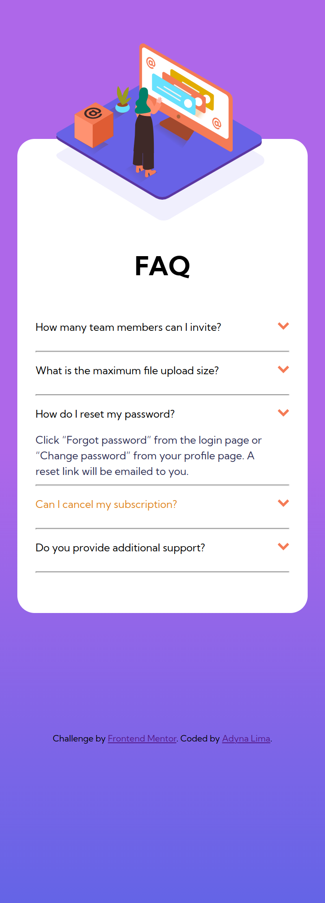

# FAQ accordion card solution

Esta é uma solução para o desafio do FAQ accordion card solution no Frontend Mentor em que desenvolvi uma página de perguntas frequentes. 

## Índice

- [Visão geral](#visão-geral)
  - [O desafio](#o-desafio)
  - [Captura de tela](#captura-de-tela)
  - [Links](#links)
- [Meu processo](#meu-processo)
  - [Tecnologias utilizadas](#tecnologias-utilizadas)
  - [O que aprendi](#o-que-aprendi)
  - [Status do projeto](#status-do-projeto)
- [Autora](#autora)
- [Licença](#licença)

## Visão geral

### O desafio

Os usuários devem ser capazes de:

- Veja o layout ideal para o componente, dependendo do tamanho da tela do dispositivo (375px/1250px)
- Veja os estados de foco para todos os elementos interativos na página
- Ocultar/Mostrar a resposta a uma pergunta quando a pergunta é clicada

### Captura de tela




### Links

- URL da solução: [GitHub](https://github.com/adynaslima/FAQ-accordion-card.git)
- URL do site: [Site](https://faq-accordion-card-one-phi.vercel.app/)

## Meu processo

### Tecnologias utilizadas

- Marcação HTML5 semântica
- Propriedades personalizadas CSS3
- Flexbox
- Fluxo de trabalho móvel primeiro
- JavaScript

### O que aprendi

```js
const resposta = document.querySelectorAll(".tudo");
resposta.forEach((event) => {
  event.addEventListener("click", () => {
    if (event.classList.contains("active")) {
      event.classList.remove("active");
    } else {
      event.classList.add("active");
    }
  });
});
```

### Status do projeto

Em construção...

## Autora 

- GitHub - [Adyna Lima](https://github.com/adynaslima)
- LinkedIn - [Adyna Lima](https://www.linkedin.com/in/adynalima/)

## Licença 

MIT License
